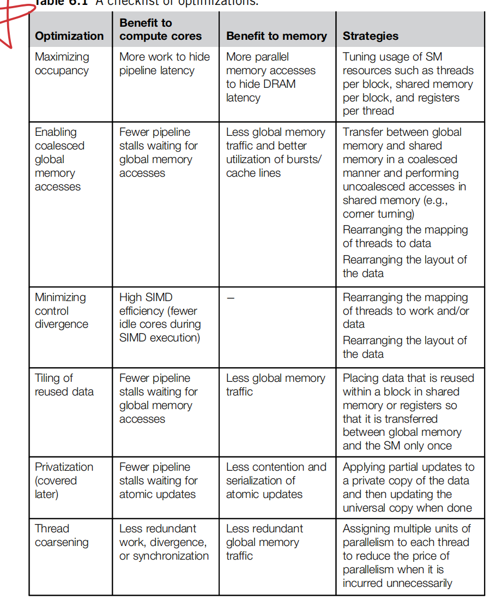
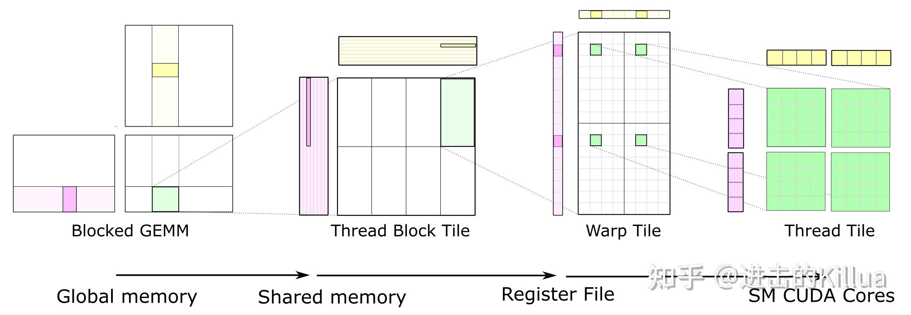

## GPU 基础

检查GPU的各项参数，包括SM的数量，shared memory的大小等。

```c++


inline int _ConvertSMVer2Cores(int major, int minor) {
  // Defines for GPU Architecture types (using the SM version to determine
  // the # of cores per SM
  typedef struct {
    int SM;  // 0xMm (hexidecimal notation), M = SM Major version,
    // and m = SM minor version
    int Cores;
  } sSMtoCores;

  sSMtoCores nGpuArchCoresPerSM[] = {
      {0x30, 192},
      {0x32, 192},
      {0x35, 192},
      {0x37, 192},
      {0x50, 128},
      {0x52, 128},
      {0x53, 128},
      {0x60,  64},
      {0x61, 128},
      {0x62, 128},
      {0x70,  64},
      {0x72,  64},
      {0x75,  64},
      {0x80,  64},
      {0x86, 128},
      {0x87, 128},
      {0x89, 128},
      {0x90, 128},
      {0xa0, 128},
      {0xa1, 128},
      {0xc0, 128},
      {-1, -1}};

  int index = 0;

  while (nGpuArchCoresPerSM[index].SM != -1) {
    if (nGpuArchCoresPerSM[index].SM == ((major << 4) + minor)) {
      return nGpuArchCoresPerSM[index].Cores;
    }

    index++;
  }

  // If we don't find the values, we default use the previous one
  // to run properly
  printf(
      "MapSMtoCores for SM %d.%d is undefined."
      "  Default to use %d Cores/SM\n",
      major, minor, nGpuArchCoresPerSM[index - 1].Cores);
  return nGpuArchCoresPerSM[index - 1].Cores;
}


int print_gpu_info(){
     int deviceCount = 0;
    cudaGetDeviceCount(&deviceCount);  // 获取可用的GPU数量

    if (deviceCount == 0) {
        printf("There is no available device that supports CUDA.\n");
        return -1;
    }

    for (int deviceId = 0; deviceId < deviceCount; ++deviceId) {
        cudaDeviceProp deviceProp;
        cudaGetDeviceProperties(&deviceProp, deviceId);

        printf("Device ID: %d\n", deviceId);

        // SM数量
        printf("  SM Number (SMs): %d\n", deviceProp.multiProcessorCount);

        // 每个SM的共享内存大小
        printf("  Shared memory per block: %ld KB\n", deviceProp.sharedMemPerBlock/ (1024));

        printf("  Shared memory per SM: %ld KB\n", deviceProp.sharedMemPerMultiprocessor / (1024));

        // 每个线程块的最大线程数
        printf("  Max threads per block: %d\n", deviceProp.maxThreadsPerBlock);

        printf("  Max threads per SM: %d\n", deviceProp.maxThreadsPerMultiProcessor);

        printf("  Warp size: %d\n", deviceProp.warpSize);


        // 最大线程数维度
        printf("  Max dimension of threads per block: (%d, %d, %d)\n", deviceProp.maxThreadsDim[0], deviceProp.maxThreadsDim[1], deviceProp.maxThreadsDim[2]);

        printf("  L2 Cache Size: %d KB\n", deviceProp.l2CacheSize / 1024);

        // 设备全局内存大小
        printf("  Global memory: %ld GB\n", deviceProp.totalGlobalMem / (1024 * 1024 * 1024) );

        //计算内存带宽和理论算力
        unsigned int memoryClockRate = deviceProp.memoryClockRate;  // 内存时钟频率 khz
        unsigned int memoryBusWidth = deviceProp.memoryBusWidth;    // 内存位宽 bit
        int memoryBandwidth = 2 * memoryClockRate * (memoryBusWidth / 8) / 1e6;  // 内存带宽 GB/s
        printf("  Memory Bandwidth: %d GB/s\n", memoryBandwidth);

        // 不同的架构每个SM有不同的核心数，例如volta架构每个SM有64个CUDA核心
        // 和线程数不同
        
        int cudacores_persm = _ConvertSMVer2Cores(deviceProp.major, deviceProp.minor);

        printf("  CUDA Cores per SM: %d\n", cudacores_persm);
        
        // deviceProp.clockRate 是 khz，所以要除以 1.0e9，得到 THz
        printf("  Theoretical TFLOPS: %f\n", deviceProp.multiProcessorCount* cudacores_persm * 2.0 * deviceProp.clockRate / 1.0e9);


        // 最大块数维度
        printf("\n");

       
    }

     return 0;
}

```
RTX4090 的参数
```
Device ID: 0
  SM Number (SMs): 128
  Shared memory per block: 48 KB
  Shared memory per SM: 100 KB
  Max threads per block: 1024
  Max threads per SM: 1536
  Warp size: 32
  Max dimension of threads per block: (1024, 1024, 64)
  L2 Cache Size: 73728 KB
  Global memory: 23 GB
  Memory Bandwidth: 1008 GB/s
  CUDA Cores per SM: 128
  Theoretical TFLOPS: 82.575360
```
其中，带宽的计算是根据内存的时钟频率和内存总线宽度（DDR要乘以2表示双倍速率），即
$$
Bandwidth = memoryClock(hz) * memoryBusWidth(bit) * 2  = memoryClock(hz) * (memoryBusWidth(bit)/8) * 2 / 10^9 (GB/s)
$$

理论算力是cuda core的数量和时钟频率的乘积，由于支持FMA(fused multply-add)操作，即一次可以同时执行加乘操作，需要乘以2，即
$$
Compute = clock(hz) * cores * 2 / 10^{12} TFLOPS
$$


在GPU计算过程中，计算和内存访问是并行的，因此整体的时间由两者大的决定，即
$$
T = \max \{T_c, T_m\} \\ 
T_c = \frac{\# ops}{Compute}  \\
T_m = \frac{\# bytes}{Bandwidth}
$$
则如果$T_c > T_m$，有
$$
\frac{\# ops}{Compute} > \frac{\# bytes}{Bandwidth} \\
\frac{\# ops}{\# bytes} > \frac{Compute}{Bandwidth} \\
\text{arithmetic intensity} = \frac{\# ops}{\# bytes}
$$
因此，当arithmetic intensity大于零界点$\frac{Compute}{Bandwidth} $时，我们认为是计算密集型任务，反之，则是内存密集型任务，需要优化内存读取，提高计算密度。这就是roofline model。                        
实际上如果考虑L2 cache，内存带宽应该会比理论值高一些。               

https://www.53ai.com/news/qianyanjishu/1881.html

https://images.nvidia.com/aem-dam/Solutions/Data-Center/l4/nvidia-ada-gpu-architecture-whitepaper-v2.1.pdf

https://blog.zidea.site/p/cuda%E7%BC%96%E7%A8%8B-%E9%80%9A%E7%94%A8%E7%9F%A9%E9%98%B5%E4%B9%98%E6%B3%95gemm%E5%92%8Ccuda%E4%BC%98%E5%8C%96/#cuda%E6%9D%A5%E5%92%AF

https://www.zhihu.com/search?type=content&q=cuda%20gemm

https://docs.nvidia.com/deeplearning/performance/dl-performance-gpu-background/index.html

### 优化出发点


### 内存合并

cuda中的访存是以warp为单位的，即一个warp中的线程发出的访存指令会被合并成一个memory request，而这个request会形成一个或者多个memory transaction，分为`32-byte transaction, 64-byte transaction, 128-byte transaction`。一个线程可以一次访问1,2,4,8,16 bytes，那么一个warp就能形成32, 64, 128, 256, 512 bytes的request。然后根据内存是否连续合并成几个transaction。例如每个线程访问一个float4，如果内存连续，就需要发起4次 `128-byte transaction`。

**？待弄清楚的点：** 如何确定到达发起的是那一种 transaction。例如一个线程访问一个float，那么形成了128 bytes的request，那么是发起4次 `32-byte transaction`，还是发起1次 `128-byte transaction`。 是否和指令有关，例如使用的是`LD.32`，就只能发起`32-byte transaction`，使用的是`LD.128`，就能发起`128-byte transaction`。


使用`LD.128`的优势是什么，如果使用`LD.32`也能发起`128-byte transaction`，那么LD.128的优势是提高缓存利用？


## GEMM Kerenls

some useful kerenls created with cuda and trion

## Matrix Multiplication
optimize the gemm to achieve cublas performance

### Matirx-Matrix
计算矩阵乘法
$$
C^{m\times n} = A^{m\times k} * B^{k\times n}
$$
#### CPU单线程计算
```c++
for(int i=0; i<n; i++){
    for(int j=0; j<n; j++){
        for(int k=0; k<n; k++){
            C[i][j] += A[i][k]*B[k][j];
        }
    }
}
```

#### CUDA 优化
1. 基础版本

2. global memory 到 shared memory                 
    对矩阵进行分块，每个block处理一块矩阵，每次加载一个块的数据到shared memory，减少从global memory读取的代价。

3. shared memory 到 register

    进一步对shared memory进行分块，减少从shared memory到register的读取时间，每个线程处理一块数据，而不是一个线程处理一个数据。

4. 解决memory bank conflict 

    同一个swap的线程访问同一个bank会产生内存冲突，从而导致访问的指令变多

5. vector load 

6. 使用预取，double buffer掩盖延迟

7. tensor core 的使用





### Vector-Matirx

## Reduction

## Softmax

## Attention

### Flash Attention

### Ring Attention


