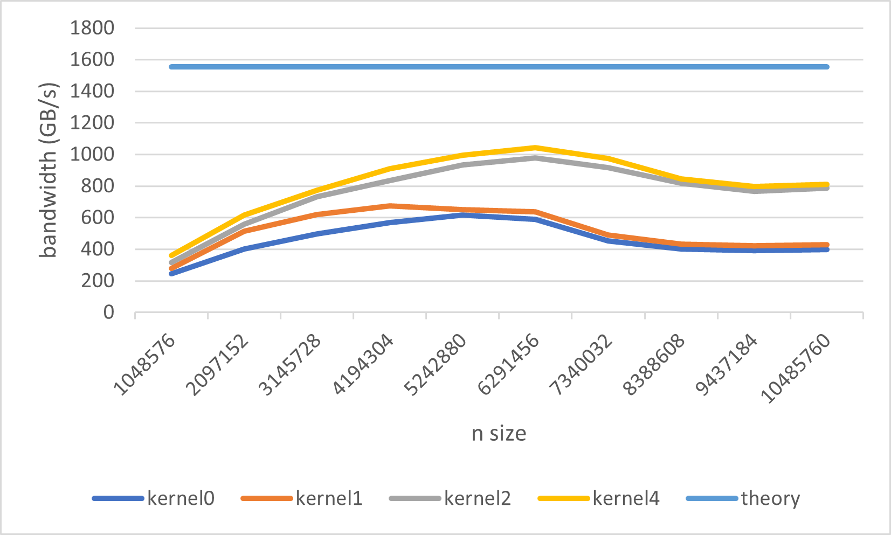

## 简介

将一个向量的数据reduce成一个结果，包括 sum, max, min。
$$

val = OP(arr), OP\in\{sum, max, min\}

$$

reduce也是访存密集的算子，其算术密度

$$
ar = \frac{n}{4n} < 1

$$

最重要的就是涉及到不同block数据的同步。当使用多个block处理数组时，需要将一个block的数据传输到另一个，只能通过global memory同步。

reduce一般就是树形规约。两个阶段：第一个阶段每一个block处理一块数据，将自己的数据在block内部规约好后，写入全局内存。第二个阶段，由第一个block完成最后的规约。其实第二个阶段就是调用第一个阶段的算子。


下面的算子是针对一维向量的，但实际中一般输入是一个数组，reduce的是数组的一行或者一列，所以一般使用一个block或者warp处理一行或者一列。


## 算子优化

只关注第一阶段的优化。 指定block的数量为108*4，即a100上SM数量的4倍；指定block的大小为256个线程。

因为是指定block的数量和大小，所以线程总数定了，并没有根据输入数组的大小调节block的数量。所以是按grid的大小把整个数组划分成块，然后每个线程i要加载`i+grid_size*k` 位置上的k个数据到自己的register相加。然后再在block内部规约。

### naive


使用shared memory作为一个block中的线程交换数据的buffer。每个线程从global memory中循环加载自己对应位置的数据到register。在将结果写入shared memory，然后进行规约。

`kernel0.cu`

```cpp
#define BLOCK_SIZE 256 //each 
__global__ void __kernel_reduce_sum(float *A, int N, float *out){

    int start_id = blockIdx.x*BLOCK_SIZE+ threadIdx.x;
    int tid = threadIdx.x;
    //add the grid 
    float val = 0;
    for(int i=start_id; i<N; i+=gridDim.x*BLOCK_SIZE){ //load itself elements
        val += A[i];
    }
    __shared__ float data[BLOCK_SIZE];
    
    data[tid] = val; //write to shared memory for exchange 
    

    __syncthreads();
    

    for(int offset=1; offset<blockDim.x; offset*=2){//each time one thread load reduce two element
        if(tid%(2*offset)==0){
            data[tid]+=data[tid+offset];
        }
        __syncthreads();
    }

    if(tid==0) //the first thread of the block to load elements
        out[blockIdx.x] = data[0];

}

```
**上面的kernel的规约的线程不是相邻的，会出现thread devergence。** 即第一轮是活跃`0,2,4...`号线程，第二轮活跃的是`0,4,...`，即同一个warp中的线程有些活跃而有些不活跃。

### 解决线程束分化

将上一个kernel中的迭代规约改成从上到下，并且每次使用前部分的线程进行规约。

`kernel1.cu`

```cpp
#define BLOCK_SIZE 256

// avoid warp divergence
// n/2->0, n/4->0, n/8->0
__global__ void __kernel_reduce_sum(float *A, int N, float *res){

    int start_id = blockIdx.x*BLOCK_SIZE+ threadIdx.x;
    int tid = threadIdx.x;
    //add the grid 
    float val = 0;
    for(int i=start_id; i<N; i+=gridDim.x*BLOCK_SIZE){
        val += A[i];
    }
    __shared__ float data[BLOCK_SIZE];
    
    data[tid] = val;
    __syncthreads();

    for(int offset=BLOCK_SIZE/2; offset>0; offset>>=1){
        if(tid<offset){
            data[tid]+=data[tid+offset];
        }
        __syncthreads();
    }
    if(tid==0)
        res[blockIdx.x] = data[0];


}
```
上面的kernel保证了每次都活跃的前面的部分线程，即第一轮激活了`0,1,2,...,127`号线程，而第二轮则是`0,1,2,...,64`号线程。当然，当规约小于32时，还是存在分化。


### 向量化加载

上面的kernel一次从global中加载一个元素，使用float4加载多个元素。

`kernel2.cu`

```cpp
#define BLOCK_SIZE 256

// avoid warp divergence
// n/2->0, n/4->0, n/8->0
__global__ void __kernel_reduce_sum(float *A, int N, float *res){

    int start_id = 4*(blockIdx.x*BLOCK_SIZE+ threadIdx.x);
    int tid = threadIdx.x;
    //add the grid 
    float val = 0;
    for(int i=start_id; i<N; i+=gridDim.x*BLOCK_SIZE*4){ //using float4
        if(i+3<N){
            float4 load_v = reinterpret_cast<float4 *>(&A[i])[0];
            val+=load_v.x;
            val+=load_v.y;
            val+=load_v.z;
            val+=load_v.w;
        }else{
            for(int ii=i; ii<N; ii++){
                val += A[ii];
            }
        }
        
    }
    __shared__ float data[BLOCK_SIZE];
    
    data[tid] = val;
    

    __syncthreads();

    for(int offset=BLOCK_SIZE/2; offset>0; offset>>=1){
        if(tid<offset){
            data[tid]+=data[tid+offset];
        }
        __syncthreads();
    }
    if(tid==0)
        res[blockIdx.x] = data[0];
}

```

### 使用寄存器

在同一个block中规约时使用了shared memory，但是其实一个warp中的线程的规约可以使用`shfl_down_sync`指令在寄存器中进行。即每个warp单独规约到第一个线程后，再使用shared memory进行规约。

但这样可以认为存在线程束分化，不一定好。


`kernel4.cu`

```cpp
#define BLOCK_SIZE 256

__global__ void __kernel_reduce_sum(float *A, int N, float *res){

    int start_id = (blockIdx.x*BLOCK_SIZE + threadIdx.x)*4;
    int tid = threadIdx.x;
    int warp_id = tid/32;
    int line_id = tid%32;
    int warp_num = BLOCK_SIZE/32;
    
    //add the grid 
    float val = 0;
    for(int i=start_id; i<N; i+=gridDim.x*BLOCK_SIZE*4){//each time load float4
        if(i+3<N){
            float4 load_val = reinterpret_cast<float4 *>(&A[i])[0];
            val += load_val.x;
            val += load_val.y;
            val += load_val.z;
            val += load_val.w;
        }else{
            for(int ii=i; ii<N; ii++){
                val += A[ii];
            }
        }
        
        
    }

    //use the shfl instruction
    //reduce all val into fisrt thread
    for(int offset=16; offset>0; offset>>=1){
        val+=__shfl_down_sync(0xffffffff, val, offset);
    }

    __shared__ float data[32];
    if(line_id==0)
        data[warp_id] = val;
    
    __syncthreads();
    if(warp_id==0){
        if(line_id<warp_num)
            val = data[line_id];
        else
            val = 0;

        for(int offset=16; offset>0; offset>>=1){
            val+=__shfl_down_sync(0xffffffff, val, offset);
        }

        if(line_id==0)
            res[blockIdx.x] = val;
    }


}

```


### 最后性能

在a100 40G上测试，理论带宽1555GB/s。




使用向量加载的性能提升比较大，但整体相较于理论带宽还有巨大差距。


