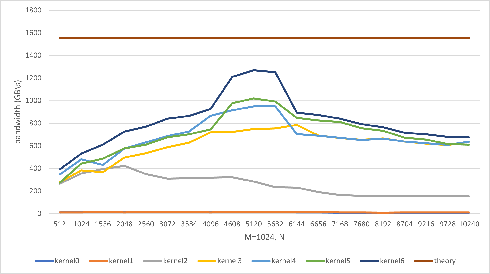
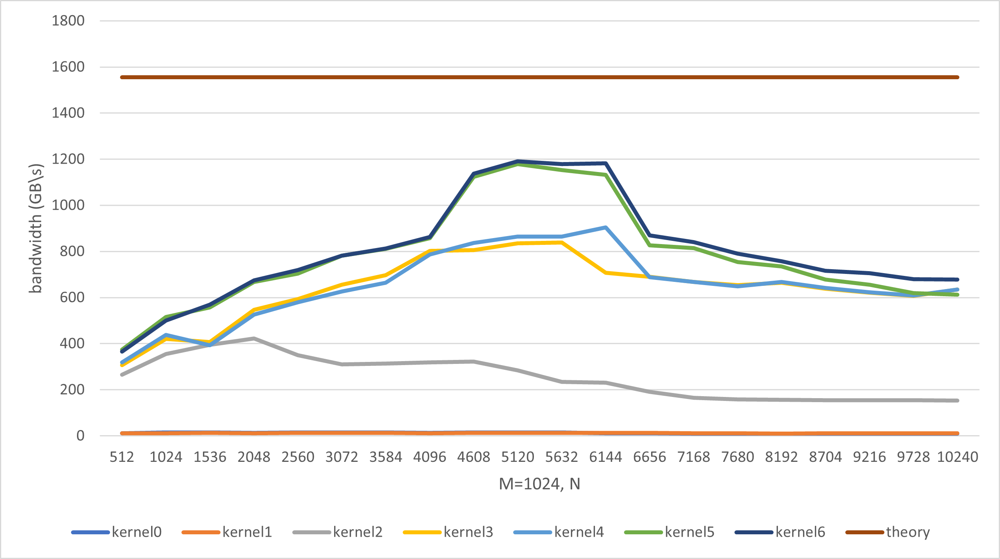

## 简介


$$

softmax(x) = \frac{e^{x_i-x_{max}}}{\sum_{i} e^{x_i-x_{max}}}

$$

减去最大值，一般是为了保证数值稳定性，防止$e^x$很大。

softmax 操作可以分为几个操作，reduce max, e^{x-max}, reduce sum, element wise divide。为了高效，一般是fused到一个kernel里面完成。

一般进行softmax的一个矩阵$A^{m\times n}$，这里以列进行softmax。

## 算子实现

### Naive

`kernel0.cu`

基础实现，一个线程处理一行元素，需要三次遍历。第一次算$x_{max}$，第二次算$\sum_{i} e^{x_i-x_{max}}$，第三次算$ \frac{e^{x_i-x_{max}}}{\sum_{i} e^{x_i-x_{max}}}$。


### Online 计算

`kernel1.cu`

上面的kernel需要读取3次数据，可以通过纠正将第一次和第二次融合在一起，即在遍历寻找最大值的过程中不断更新计算和。

假设当遍历到第k个数据时，这时的最大值$x_{max}^k$，当前的和为
$$
\sum_{i}^k e^{x_i-x^k_{max}}
$$
如果第k个数大于$x_{max}^k$，那么就需要纠正上面的和，通过乘以$e^{x^k_{max}-x_k}$，即
$$

\sum_{i}^k e^{x_i-x^k_{max}} * e^{x^k_{max}-x_k} = \sum_{i}^k e^{x_i-x_k}
$$

所以基本的算法流程是 
```python
max_val = x[0];
sum_base = exp(max_val-x[0]);
for(int i=1; i<n; i++){
    if(max_val<x[i]){
        sum_base = sum_base*exp(max_val-x[i]); //correct the val
        max_val = x[i];
    }
    sum_base += exp(x[i]-max_val);

}
```

### 一个warp处理一行

`kernel2.cu`

一个线程处理一行太慢，使用一个warp处理一行。使用`__shfl_down_sync()`进行规约，将最大值规约到第一个线程。然后第一个线程将最大值使用`__shfl_sync()`广播到其他所有线程。然后每个线程使用最大值纠正自己的sum，然后再进行规约，规约完后再进行广播。现在每个线程就得到了正确的sum，最后计算。

### 一个block处理一行

`kernel3.cu`

一个warp只有32个线程，所以当n大于1024时，如果还是使用一个warp处理，每个线程的工作量就大于了32个元素。所以当$n>1024$时，使用一个block处理一行元素。使用shared memory进行规约。


### Shared Mem

`kernel4.cu`

当矩阵的n比较小的时候，可以直接把一整行加载到shared memory。例如A100一个SM拥有192KB的shared memory，一行的数据大小为$4nB$。所以当n较小时，例如小于等于$4094$，那么一行数据小于$16KB$。当$m$小于1024时（一般相对于n较小），可以直接加载到shared memory。

所以，当$n<=4096$时，将数据全部加载到shared memory，那么就可以只读取一次全局内存，而上面的kernel需要读取两次，第一次计算max，第二次计算最后的结果。

这里只作用于 $n\in (1024, 4096]$，即按block一行的情况。


### 向量化加载

`kernel5.cu`

使用float4加载和存储结果。


### Warp Level 指令

`kernel6.cu`

当$n>1024$，使用的是block处理，数据的规约是通过shared memory。为了减少读写shared memory，一个warp内的规约使用`__shfl_down_sync()`，然后通过shared memory进行warp间的通信。

### 总结

上面优化根据$n$的大小总共分为了3类：

|$n$|Level|优化手段|
|---|---|---|
|$(, 1024]$|Warp Level|warp_level指令规约，向量化加载|
|$(1024, 4096]$|Block Level|使用shared memory存储整行数据，向量化加载，warp_level指令规约|
|$(4096, )$|Block Level|向量化加载，warp_level指令规约|

在$m=1024, n=512, 1024, 1536, ..., 10240$条件下，A100 40GB设备测试（理论带宽1555GB/s）。



（1）从`kernel2`到`kernel3`提升较大，说明当n很大时，使用block处理一行，可以大幅度提高速度。            
（2）从`kernel3`到`kernel4`，1024到4096这一段的速度有提升，说明shared memory存储能减少加载代价。4096到5632也变快了，不合理，应该是测试问题。             
（3）从`kernel4`到`kernel5`，向量加载有一定提升，但是不大。            
（4）从`kernel5`到`kernel6`，使用warp内部规约有一定效果。                    
（5）整体相较于理论带宽还有较大差距，最高应该只能达到70%多。                     


再次测试，结果变化较大



整体来说，较为有效的kerenl是，block计算一行+shared memory规约+向量化加载，即下面的kernel
```cpp

#define WARP_SIZE 32
#define BLOCK_SIZE 256

__global__ void __kernel_fused_softmax_block_level(float *A, int m, int n){

    int tid = threadIdx.x;
    // int warp_id = tid / WARP_SIZE;
    // int line_id = tid % WARP_SIZE;
    // int warp_num = blockDim.x/WARP_SIZE;
    int row = blockIdx.x;

    if(row<m){
        float *Current_Row = A+row*n;
        __shared__ float data[BLOCK_SIZE];
        
        float max_val = -INFINITY;
        float norm_base = 0;
        for(int i=tid*4; i<n; i+=BLOCK_SIZE*4){
            
            if(i+3<n){
                float4 cur =  reinterpret_cast<float4 *>(&Current_Row[i])[0];
                float temp_max = max(cur.x, cur.y);
                temp_max = max(temp_max, cur.z);
                temp_max = max(temp_max, cur.w);

                if(temp_max>max_val){
                    norm_base = norm_base*expf(max_val-temp_max);
                    max_val = temp_max;
                }

                norm_base += expf(cur.x - max_val);
                norm_base += expf(cur.y - max_val);
                norm_base += expf(cur.z - max_val);
                norm_base += expf(cur.w - max_val);

            }else{
                for(int ii=i; ii<n; ii++){
                    float cur = Current_Row[ii];
                    if(max_val<cur){
                        norm_base = norm_base*expf(max_val-cur);
                        max_val = cur;
                    }
                    norm_base += expf(cur-max_val);
                }
            }

           
        }

        data[tid] = max_val;
        __syncthreads();
        for(int offset=BLOCK_SIZE/2; offset>0; offset>>=1){
            if(tid<offset){
                data[tid] = max(data[tid], data[tid+offset]);
            }
            __syncthreads();
        }

        float global_max_val = data[0];

        norm_base = norm_base*expf(max_val-global_max_val);
        
        //reduce the norm_base
        data[tid] = norm_base;

        __syncthreads();
        for(int offset=BLOCK_SIZE/2; offset>0; offset>>=1){
            if(tid<offset){
                data[tid] += data[tid+offset];
            }
            __syncthreads();
        }

        norm_base = data[0];

        for(int i=tid*4; i<n; i+=BLOCK_SIZE*4){
            // float cur = Current_Row[i];
            // Current_Row[i] = expf(cur-global_max_val)/norm_base;


            if(i+3<n){
                float4 cur =  reinterpret_cast<float4 *>(&Current_Row[i])[0];
                cur.x =  expf(cur.x - global_max_val)/norm_base;
                cur.y =  expf(cur.y - global_max_val)/norm_base;
                cur.z =  expf(cur.z - global_max_val)/norm_base;
                cur.w =  expf(cur.w - global_max_val)/norm_base;

                reinterpret_cast<float4 *>(&Current_Row[i])[0] = cur;

            }else{
                for(int ii=i; ii<n; ii++){
                    float cur = Current_Row[ii];
                    Current_Row[ii] = expf(cur-global_max_val)/norm_base;
                }
            }
        }


    }


}

void fused_softmax(float *A, int m, int n){
   
    dim3 block(BLOCK_SIZE);
    dim3 grid(m);
    __kernel_fused_softmax_block_level<<<grid, block>>>(A, m, n);
    
   
    
}

```


### 参考

https://maharshi.bearblog.dev/optimizing-softmax-cuda/